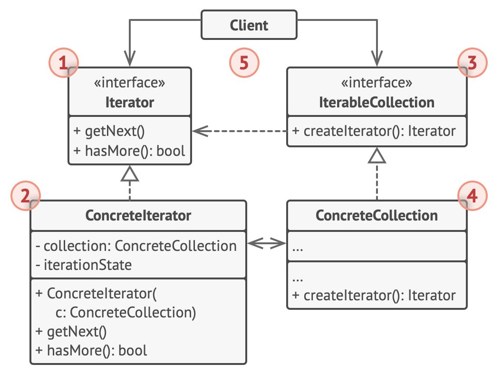

# Iterator design pattern

## Structure

1. The Iterator interface declares the operations required for traversing a collection: fetching the next element, retrieving the current position, restarting iteration, etc.

2. Concrete Iterators implement specific algorithms for traversing a collection.

   - The iterator object should track the traversal progress on its own.
   - This allows several iterators to traverse the same collection independently of each other.

3. The Collection interface declares one or multiple methods for getting iterators compatible with the collection.

   - Note that the return type of the methods must be declared as the iterator interface so that the concrete collections can return various kinds of iterators.

4. Concrete Collections return new instances of a particular concrete iterator class each time the client requests one.

   - You might be wondering, where’s the rest of the collection’s code? Don’t worry, it should be in the same class.
   - It’s just that these details aren’t crucial to the actual pattern, so we’re omitting them.

5. The Client works with both collections and iterators via their interfaces.
   - This way the client isn’t coupled to concrete classes, allowing you to use various collections and iterators with the same client code.
   - Typically, clients don’t create iterators on their own, but instead get them from collections.
   - Yet, in certain cases, the client can create one directly; for example, when the client defines its own special iterator.
