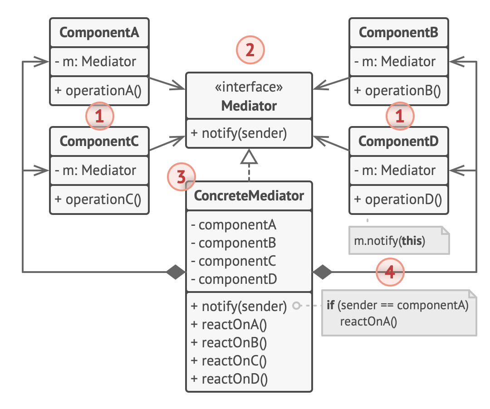

# Mediator design pattern

## Structure

1. Components are various classes that contain some business logic.

   - Each component has a reference to a mediator, declared with the type of the mediator interface.
   - The component isn’t aware of the actual class of the mediator, so you can reuse the component in other programs by linking it to a different mediator.

2. The Mediator interface declares methods of communication with components, which usually include just a single notification method.

   - Components may pass any context as arguments of this method, including their own objects, but only in such a way that no coupling occurs between a receiving component and the sender’s class.

3. Concrete Mediators encapsulate relations between various components.

   - Concrete mediators often keep references to all components they manage and sometimes even manage their lifecycle.

4. Components must not be aware of other components.
   - If something important happens within or to a component, it must only notify the mediator.
   - When the mediator receives the notification, it can easily identify the sender, which might be just enough to decide what component should be triggered in return.
   - From a component’s perspective, it all looks like a total black box.
   - The sender doesn’t know who’ll end up handling its request, and the receiver doesn’t know who sent the request in the first place.
