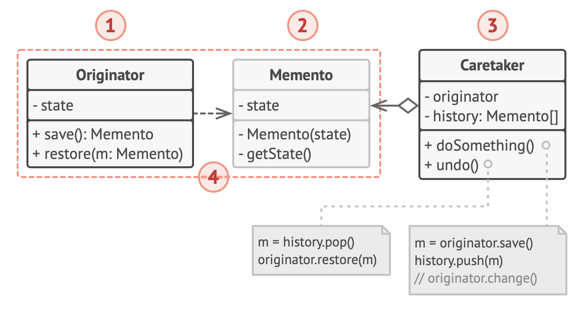

# Memento design pattern

## Structure

1. The Originator class can produce snapshots of its own state, as well as restore its state from snapshots when needed.

2. The Memento is a value object that acts as a snapshot of the originator’s state.

   - It’s a common practice to make the memento immutable and pass it the data only once, via the constructor.

3. The Caretaker knows not only “when” and “why” to capture the originator’s state, but also when the state should be restored.

   - A caretaker can keep track of the originator’s history by storing a stack of mementos. When the originator has to travel back in history, the caretaker fetches the topmost memento from the stack and passes it to the originator’s restoration method.

4. In this implementation, the memento class is nested inside the originator.
   - This lets the originator access the fields and methods of the memento, even though they’re declared private.
   - On the other hand, the caretaker has very limited access to the memento’s fields and methods, which lets it store mementos in a stack but not tamper with their state.
