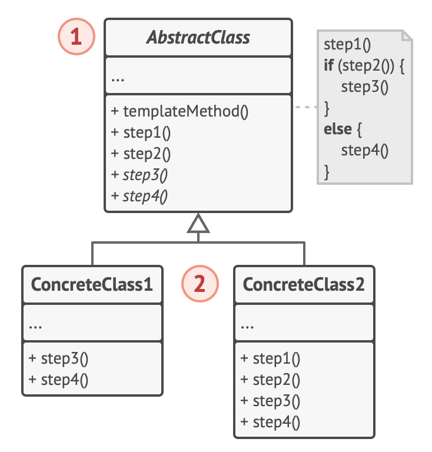

# Template design pattern

## Structure

1. The Abstract Class declares methods that act as steps of an algorithm, as well as the actual template method which calls these methods in a specific order.

   - The steps may either be declared abstract or have some default implementation.

2. Concrete Classes can override all of the steps, but not the template method itself.
