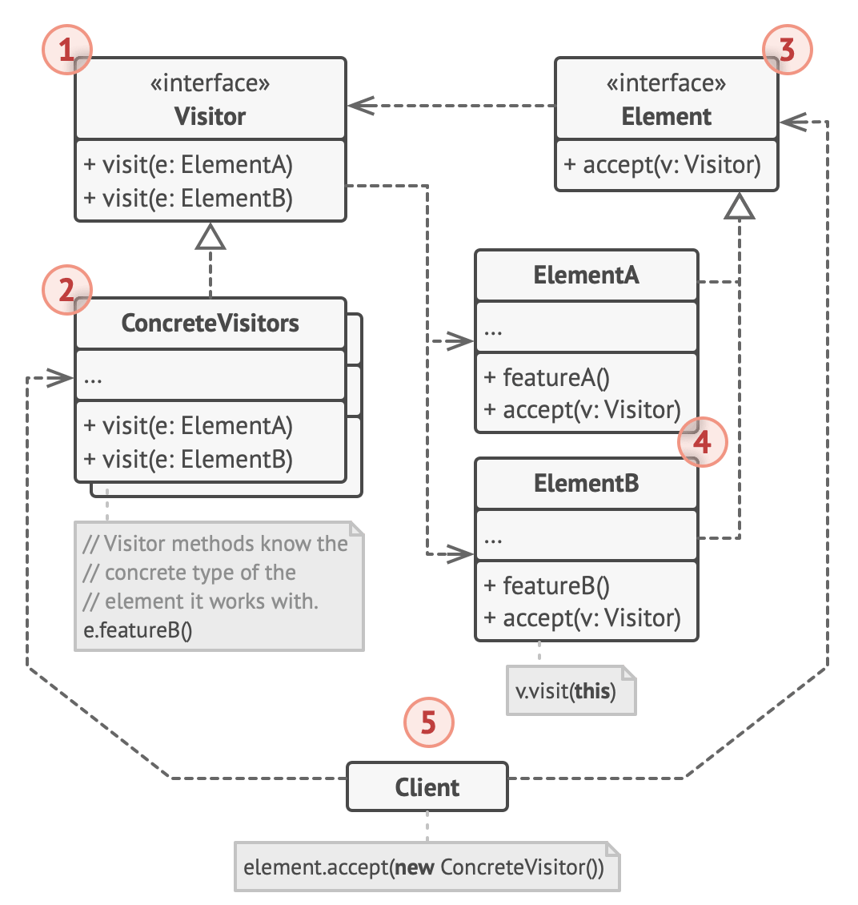

# Visitor design pattern

## Structure

1. The Visitor interface declares a set of visiting methods that can take concrete elements of an object structure as arguments.

   - These methods may have the same names if the program is written in a language that supports overloading, but the type of their parameters must be different.

2. Each Concrete Visitor implements several versions of the same behaviors, tailored for different concrete element classes.

3. The Element interface declares a method for “accepting” visitors.

   - This method should have one parameter declared with the type of the visitor interface.

4. Each Concrete Element must implement the acceptance method.

   - The purpose of this method is to redirect the call to the proper visitor’s method corresponding to the current element class.
   - Be aware that even if a base element class implements this method, all subclasses must still override this method in their own classes and call the appropriate method on the visitor object.

5. The Client usually represents a collection or some other complex object (for example, a Composite tree).
   - Usually, clients aren’t aware of all the concrete element classes because they work with objects from that collection via some abstract interface.
