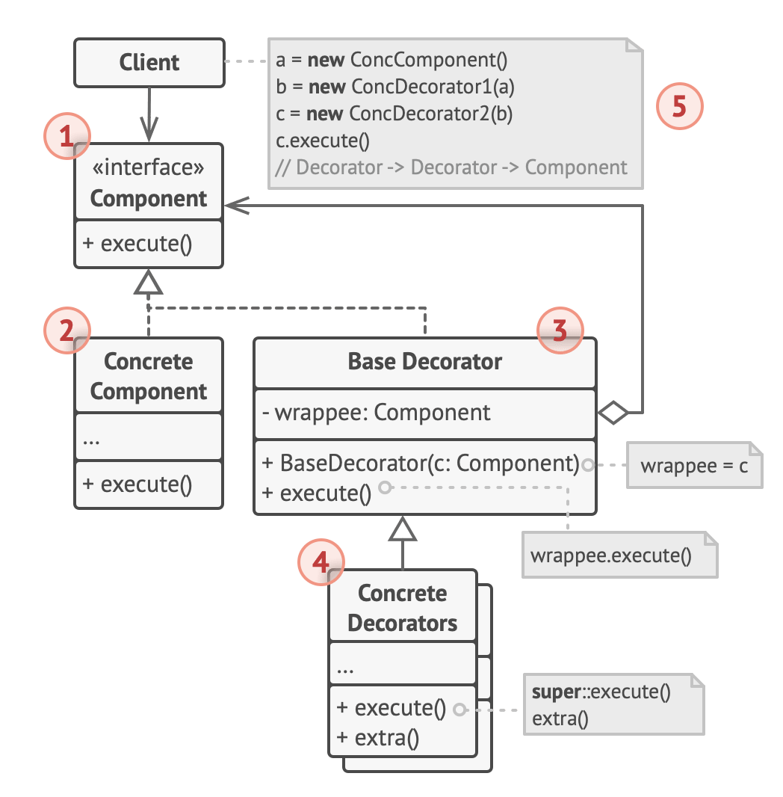

# Decorator design pattern

- original definition
  - Attach additional responsibilities to an object dynamically
  - decorators provide a flexible alternative to sub classing for extending functionality
- a good way to define pluggable behaviors and features for clients that do not alter their original function but add extra abilities
- also known as a wrapper pattern
  - when used with functions, a decorator ingests a function and returns back a function
    - this way it behaves as a higher order function
- example
  - the react framework uses the concept of higher order components
    - which results in a component gaining extra abilities and functionality

## Structure

1. The Component declares the common interface for both wrappers and wrapped objects.

2. Concrete Component is a class of objects being wrapped.

   - It defines the basic behavior, which can be altered by decorators.

3. The Base Decorator class has a field for referencing a wrapped object.

   - The field’s type should be declared as the component interface so it can contain both concrete components and decorators.
   - The base decorator delegates all operations to the wrapped object.

4. Concrete Decorators define extra behaviors that can be added to components dynamically.

   - Concrete decorators override methods of the base decorator and execute their behavior either before or after calling the parent method.

5. The Client can wrap components in multiple layers of decorators, as long as it works with all objects via the component interface.

## Summary

- the decorator pattern, ingests a function and returns back a function
- decorators can be used to add features and function to existing objects dynamically
- implemented as higher order functions

### Javascript

- the TC39 has proposed the decorator (@decorator) syntax for use with classes and class methods
- until the format is released, the decorator syntax can be implemented using the babel complier

### Python

- the decorator design pattern is NOT the same as the python decorator / function wrapper
